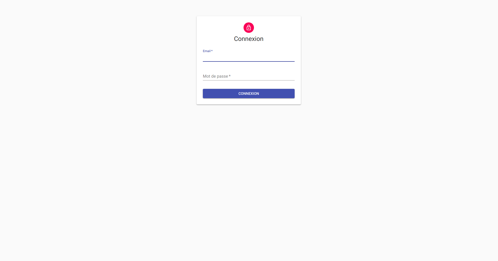
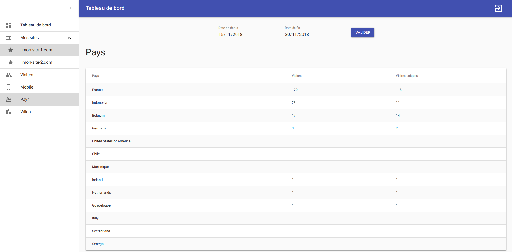

# MyAnalytics

This is an **Analytics Tool** I made using **Node.js** and **React.js**.


## Description

An image is placed in the footer of a website and fires a request to an **API** every time a page loads:

```html

```

The API processes the request and creates a **visit** containing information about the **country** and **city** from which the request has been made, the **device** that has been used, the **website** that received that visit and the **user** who owns it.

The visit is then stored in a **MongoDB** collection. 

The API also provides **routes** to **register** / **login** users and **authenticate** them (using **JSON Web Token**, **Bcrypt** and **JSON Schemas**).

From a **front-end interface**, the user can then access his websites **analytics data** that are represented using  **charts** in order to ease their reading (*see screenshots below*).

**Ansible** is used locally to provision the **Virtual Machine** built with **Vagrant** and in production to provision the **VPS**.

**Capistrano** is used to **deploy** the application and execute commands remotely.


## Local Installation

Clone project:

```bash
$ git clone git@github.com:julienreo/my-analytics-react-node.git
```

### API

Add `api.my-analytics.test` host to `/etc/hosts` file:

```bash
$ sudo vim /etc/hosts
# Add the followings IP address / host pairs
192.168.33.90 app.my-analytics.test
192.168.33.90 api.my-analytics.test
```


Create, launch and SSH into the Vagrant:

```bash
$ vagrant up
$ vagrant ssh
```

Install dependencies:

```bash
$ cd /var/www/my_analytics/api
$ yarn install
```

Start API:

```bash
$ cd /var/www/my_analytics
$ pm2 start dev.config.json
```

### Client

Install dependencies:

```bash
$ vagrant ssh
$ cd /var/www/my_analytics/app
$ yarn install
```

Launch app:

```bash
$ yarn start
```

Access app through your browser: `http://app.my-analytics.test`


## Deployment

```bash
$ cap production deploy
```


## Screenshots

### Client






